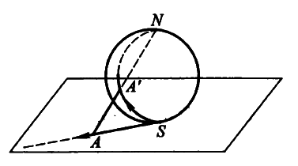
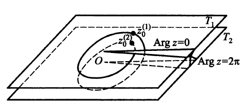

## 数学物理方法 总结

[TOC]

### Chapter 1 复变函数 Complex analysis

#### Section 1.1 复数的一些概念

##### 复数的形式

- **代数式** $z = x + iy$ 
    - $x \equiv \mathrm{Re} z$ 实部，$y \equiv \mathrm{Im} \, z$ 虚部
- **三角式** $z = \rho ( \cos \phi + i \sin \phi )$ 
  - $\rho$, magnitude
    - $\rho = | z | = z z^*$
  - **幅角** $\phi \equiv \mathrm{Arg} \, z$, argument
    - 幅角可以取无穷多个值（因为是$2\pi$的周期函数），因此约定 **主幅角** $\mathrm{arg} \, z$ 为在 $0$ 到 $2\pi$ 间的幅角.
    - $\phi = \mathrm{Arg} \, z = \mathrm{arg} \, z + 2k\pi​$，其中$k \in \mathbb{Z}​$.
- **指数式** $z = \rho e^{i \phi}$

##### 无限远点

复平面上的任何一点，都可以通过测地投影与上图构造的**复数球**上的点（A'）一一对应。无限远处的点都会被投影到N点上，因此可以将无限远看成一点，称为 **无限远点**.

##### 基本运算

**Addition, Subtract:**
$$
z_1 + z_2 = (x_1 + x_2) + i (y_1 + y_2)
$$
**Multiplication:** 
$$
\begin{align}
z_1 z_2 & = (x_1 x_2 - y_1 y_2) + i (x_1 y_2 + x_2 y_1) \\
& = \rho_1 \rho_2 e^{i(\phi_1 + \phi_2)}
\end{align}
$$
*Note:* $z z^* = x^2 + y^2 = |z| $.

Warning: $\sqrt{-2} \cdot \sqrt{-3} = - \sqrt{6}$。

**Division, Quotient:**
$$
\begin{align}
\frac{z_1}{z_2} & = \frac{x_1 + iy_1}{x_2 + iy_2} 
= \frac{x_1 x_2 + y_1 y_2}{ x_2^2+y_2^2 } + i \frac{x_2 y_1 - x_1 y_2}{ x_2^2+y_2^2 } \\
& = \frac{\rho_1}{\rho_2} e^{i(\phi_1 - \phi_2)}
\end{align}
$$
**Power, Root:**
$$
z^n = \rho^n e^{in\phi} \\
\sqrt[n]{\rho} = e^{i\phi/n}
$$
*Note: 对于开根操作，由于 $\phi$ 可以相差 $2\pi$，因此$\phi/n$ 可以相差 $2\pi / n$的整数倍。这只是对于指数n为分数的情况。若n是整数的话，相当于加上整数倍的$2\pi$，因此没有变化.*

**Warning: 注意是开根之前的$\phi$加上$2\pi$，而不是开根以后的幅角加上$2\pi$.**

**Logarithm:**
$$
\ln z = \ln \rho e^{i \phi} = \ln |z| + i \mathrm{Arg} \, z = \ln \rho + i (\phi + 2k\pi)
$$
因此，对于复数指数
$$
z ^ s = e^{s \ln z} = e^{s (\ln \rho + i (\phi + 2k\pi))}
$$
Examples.
$$
\ln i = i(\frac{\pi}{2} + 2k\pi) \\
i^i = e^{-(\frac{\pi}{2} + 2k\pi)}
$$

#### Section 1.2 复变函数

**Def (复变函数)**. 在**复数平面**上存在一个点集E，对于E上每一点，按照一定规律有**一个或多个复数值w**与之对应，则称w为z的**复变函数**，z称为w的宗量. 记为
$$
w = f(z), \, z \in E.
$$
Note: 定义域 —— 复数域$\mathbb{C}$上的一个点集，值域 —— 同样是复数域$\mathbb{C}$上的一个点集。因此相当于输入$x + iy$输出$a + ib$.

##### 一些拓扑概念

- 邻域，内点，外点
- 边界点：邻域里有内点也有外点 → 边界线
- **区域**

  - 全由内点组成
  - 连通性

##### 初等函数

$z \in \mathbb{C}$，
$$
e^z \equiv e^x e^{iy} = e^x (\cos y + i\sin y)\\
\sin z \equiv \frac{1}{2i}(e^{iz} - e^{-iz}) \\
\cos z \equiv \frac{1}{2}(e^{iz} + e^{-iz}) \\
\ln z \equiv \ln |z| + i \mathrm{Arg} \, z \\
z^s \equiv e^{ s \ln z } \\
\mathrm{sh} \, z \equiv \frac{1}{2}(e^{z} - e^{-z}) \\
\mathrm{ch} \, z \equiv \frac{1}{2}(e^{z} + e^{-z})
$$
Note: 此处的$\sin z, \cos z$的模完全可以大于1.

Note: $e^z, \mathrm{sh} \, z, \mathrm{ch} \, z$ 具有纯虚数周期 $2\pi$.

##### 实变函数 → 复变函数

$$
f(x + iy) = u(x,y) + i v(x,y)
$$

可以通过这种转换，用理解实变函数的方式理解复变函数的一些性质.

**连续：** 对于复变函数，连续的定义是  当$z \to z_0$时，有$f(z) \to f(z_0)$. 

另一种写法：当$x \to x_0, y \to y_0$,有 $u(x,y) \to u(x_0, y_0), v(x,y) \to v(x_0, y_0)$.

#### Section 1.3 导数

**Def (导数)**. 设单值函数$w = f(z)$，若极限
$$
\lim_{\Delta z \to 0} \frac{\Delta w}{\Delta z} = \lim_{\Delta z \to 0} \frac{f(z + \Delta z) - f(z)}{\Delta z}
$$
存在（与$\Delta z \to 0$的方式无关），则$f(z)$在该点可导，此极限称为$f(z)$在$z_0$处的导数，记为$\frac{\mathrm{d} f}{\mathrm{d} z}, f'(z)$.

Note: 实变函数的求导规则，大部分可以形式上应用于复变函数.

##### 可导条件

一个必要条件：**Cauchy-Riemann方程**

固定y，令$\Delta x \to 0$：得到
$$
\frac{\partial u}{\partial x} + i \frac{\partial v}{\partial x},
$$

同理，固定x，令$i \Delta y \to 0$：得到
$$
\frac{\partial v}{\partial y} - i \frac{\partial u}{\partial y},
$$

如果可导，那么上面两式必然取等. 分离实部虚部得到
$$
\begin{cases}
\frac{\partial u}{\partial x} = \frac{\partial v}{\partial y} \\
\frac{\partial v}{\partial x} = -\frac{\partial u}{\partial y}
\end{cases}
$$
或者可以换到极坐标中，$\Delta z = \Delta \rho e^{i \phi} + \Delta \phi \cdot i \rho e^{i \phi}$. 从而有
$$
\begin{cases}
\frac{\partial u}{\partial \rho} = \frac{1}{\rho} \frac{\partial v}{\partial \phi} \\
\frac{\partial v}{\partial \rho} = -\frac{1}{\rho} \frac{\partial u}{\partial \phi}
\end{cases}
$$
**可导的充分必要条件**  $f(z)$的偏导数$\frac{\partial u}{\partial x}, \frac{\partial u}{\partial y}, \frac{\partial v}{\partial x}, \frac{\partial v}{\partial y}$存在，**且连续**，且满足C-R方程.

直观的判断方法（清爽程度判断法）：用$z$, $z^*$ 把函数$f(z)$表示出来，然后判断是否
$$
\frac{\partial f}{\partial z^*} = 0.
$$

Note: 该法等价于C-R条件.

Example: 在0点可导，其他地方处处不可导：$f(z) = |z|^2 = zz^*$. 

#### Section 1.4 解析函数

**Def (解析函数).** $f(z)$ 在 $z_0$ 及其邻域内**处处可导** $ \implies $ $f(z)$ 在 $z_0$ 处解析. $f(z)$ 在区域B上每一点解析 $\implies f(z)$ 在B上是解析函数.

##### 性质

若 $f(z) = u(x,y) + i v(x,y)$ 在B上解析

- $u(x,y)=c$ 与 $v(x,y)=c$ 相互正交.
  - 证明：C-R方程代入后 $\nabla u \cdot \nabla v = 0$.
- $u(x,y), v(x,y)​$ 都是**调和函数**. 即 ${\nabla}^2 u = {\nabla}^2 v = 0​$.
  - 证明：若要证明u是调和函数，可利用C-R方程，消去v项，即可得到 ${\nabla}^2 u = 0$.

##### 共轭调和函数

u和v都满足二维Laplace方程，同时又是一个复变函数的实部和虚部，因此又称为**共轭调和函数**.

**给定某个调和函数，可以把它视作某解析函数的实部或虚部，然后用C-R条件求出剩下的另一半.**
$$
\mathrm{d} v = \frac{\partial v}{\partial x} \mathrm{d}x + \frac{\partial v}{\partial y} \mathrm{d}y \\
= - \frac{\partial u}{\partial y} \mathrm{d}x + \frac{\partial u}{\partial x} \mathrm{d}y
$$
Note: 求解的时候善用对称性. 经常考虑极坐标下是不是会更好处理.

#### Section 1.5 平面标量场

对于一个满足2D Laplace方程的场，可以用一个解析函数来描述：用其**实部表示场的势**，**虚部就是对应的通量函数**.
易见等势线族 $u(x,y)=c$ 垂直于 $v(x,y)=c$， 因此可以断言 $v(x,y)=c$ 就是场线族.

对于 $v(x,y)$ 是通量函数的证明：
$$
\begin{align}
N & = \int_A^B \mathbf{E} \, \mathrm{d} \mathbf{S} \\
& = \int_A^B \left(\frac{\partial u}{\partial x}, \frac{\partial u}{\partial y} \right) 
\cdot (\mathrm{d}y, -\mathrm{d}x) \\
& = \int_A^B \left(\frac{\partial v}{\partial y}, -\frac{\partial v}{\partial x} \right) 
\cdot (\mathrm{d}y, -\mathrm{d}x) \\
& = v(x_2, y_2) - v(x_1, y_1)

\end{align}
$$

直观也很好理解，通量相同的一条线$v(x,y)=c$，本身必定是场线，因为满足Laplace方程的场，场线不相交。

##### 通过场线族求场和势 

由此也产生了一种通过场线求势和场本身的方法。

步骤大概如下

1. 判断给出场线族的场线函数是否是调和函数，即判断 $\nabla^2 v = 0$ 是否成立.
1. 如果不成立，寻找局部单调的函数 $F(v) = c$，使得 $\nabla^2 F(v) = 0$ 成立.
1. 使用C-R方程，求出势函数 $u(x,y)$.
1. 求出场 $\nabla u$.

#### Section 1.6 多值函数

在复变函数中，许多简单的函数都有多值性，例如 $\ln z, \sqrt{z}$ 等等. 多值性的来源往往来自开方操作或者对数操作，使得原本包裹在周期函数 $e^{i\phi}$ 内的幅角暴露出来，致使幅角的多值性化为整个函数的多值性.

Ex. 
$$
w = \sqrt{z} = \sqrt{\rho e^{i(\phi + 2k\pi)}} = \sqrt{\rho} e^{i(\phi/2 + k\pi)}
$$

该函数可以分为两支，分别对应着w的幅角为
$$
\frac{1}{2} \phi \, , \frac{1}{2} \phi + \pi
$$
的两种情况. 称为w的两个单值分支.

##### 支点

如果对例子中的函数，以$\rho = \epsilon$从$0 \to 2\pi$转一个圈，可以发现，函数值没有回到0时的状态，此时右侧e上的指数为$\pi$（这就是第二个分支存在的原因，函数从一支在转一圈后进入第二支）. 故称0点为**支点**（branch point），而再转一圈后函数值复原，因此管这个支点叫做**一阶支点**.

无穷大$\infty$也可以作为支点. 具体验证方法是设 $t = 1/z$，然后代回检查 $t = 0$ 是否是支点.

Note: 一个已经验证了的结论：形如 
$$
\sqrt{(z-a_1)(z-a_2) \dots (z-a_n)}
$$
的函数，如果根号下的项数是偶数，则$\infty$不是支点；如果根号下是奇数，$\infty$是支点。

##### 黎曼面

为了解决同样的位置有两个函数值的问题，可以把函数两支分别放入两个平面，然后在某个位置切一刀，把两个平面相互粘起来，让一个绕到这个位置的点从上平面进入下平面，从下平面进入上平面.

Note: 黎曼面总是连接支点的. 如果无穷大是一个支点，则黎曼面应该是延伸到无穷大的.