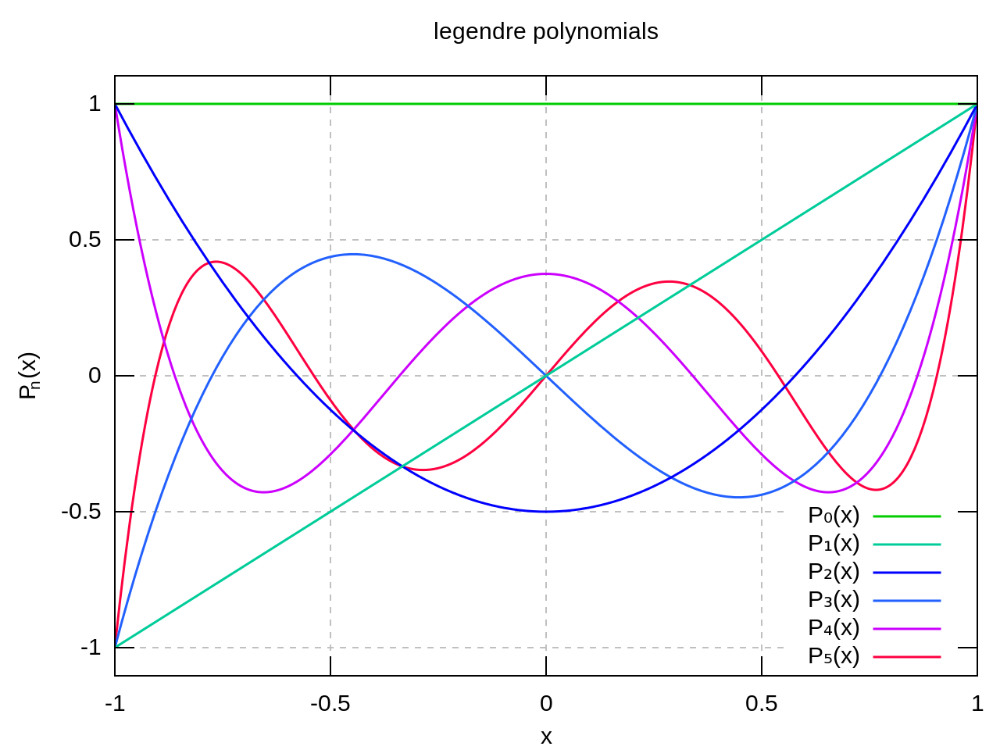
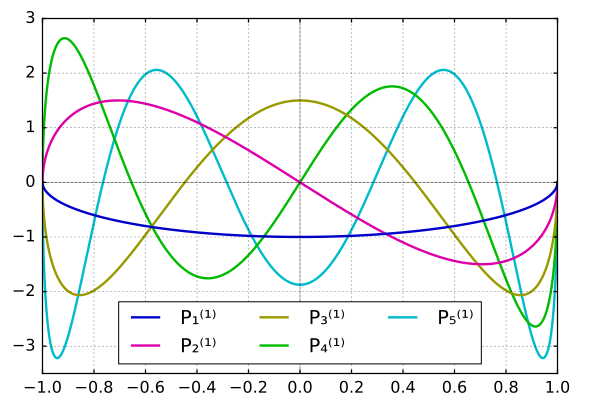
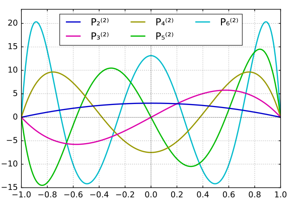

## 数学物理方法 总结

[TOC]

### Chap 10. 球函数

这一章主要是介绍解之前常微分方程出现的特殊函数的一些性质. 以及怎么用它们去表示一个Laplace方程的解.

#### Legendre函数

##### Legendre函数的引入

Legendre函数出现在解球坐标下的Laplace方程时，分离出来的角度分量的球函数方程中. **当角度部分与 $\phi$ 无关时**，$Y = \Theta$ ，球函数方程
$$
\frac{1}{\sin \theta}\frac{\partial }{\partial \theta} \left( \sin \theta  \frac{\partial Y}{\partial \theta}\right)
+  \frac{1}{\sin^2 \theta}\frac{\partial^2 Y}{\partial \phi^2} + l(l+1) Y = 0.
$$

退化为Legendre方程
$$
\frac{1}{\sin \theta}\frac{\partial }{\partial \theta} \left( \sin \theta  \frac{\partial \Theta}{\partial \theta}\right) + l(l+1) \Theta = 0.
$$

我们之后令 $x = \cos \theta$ ，方程变形为
$$
(1-x^2) \frac{\mathrm{d}^2\Theta}{\mathrm{d} x^2} -2x \frac{\mathrm{d}\Theta}{\mathrm{d} x} + l(l+1) \Theta = 0.
$$

它的解（在自然边界条件 $|\Theta| < +\infty$ 下）就是一系列Legendre函数
$$
P_l(x) = \sum_{k=0}^{\lfloor l/2 \rfloor}(-1)^k \frac{(2l-2k)!}{2^l(l-k)!(l-2k)!} x^{l-2k}, \quad x\in [-1,1].
$$
结合径向方程
$$
\frac{\partial }{\partial r} \left(r^2 \frac{\partial R}{\partial r} \right)  - l(l+1) R = 0, 
$$
它们共同组成球坐标下Laplace的解
$$
\begin{cases}
R(r) = Cr^l + Dr^{-(l+1)} \\
P_l(x) = \sum_{k=0}^{\lfloor l/2 \rfloor}(-1)^k \frac{(2l-2k)!}{2^l(l-k)!(l-2k)!} x^{l-2k}.
\end{cases} \\
\implies u(r, \theta) = \sum_{l=0}^{+\infty} \left( A_lr^l + Br^{-(l+1)} \right)P_l(\cos \theta).
$$

**Note**： 
1. 因为奇数阶Legendre函数只具有级数次幂，偶数阶Legendre函数只有偶数幂，**因此奇数阶Legendre函数是奇函数，偶数阶Legendre函数是偶函数.**
2. 可以看出R中的l是Legendre方程的本征值，是由Legendre方程决定的. 为什么不是由R决定的？**这是因为我们在求解Laplace方程的时候默认了关于 $\theta$ 的自然边界条件，而把关于 $r$ 的边界条件当成了“初始条件”用**——用得到的解的形式展开它确定解中的待定常数. 不能反过把  $\theta$ 的“自然边界条件”当成“初始条件”用，这简直是显然的. 
3. 同时这也意味着一个提法恰当的球坐标下的Laplace方程，不会再额外给定关于 $\theta$ 的其他边界条件. 否则必须从原始常微分方程的求解开始重新考虑.

##### 前几个Legendre函数

Legendre函数是经过调整过的Legendre的解，保证了最高项的系数都是
$$
a_l = \frac{(2l)!}{2^l(l!)^2}.
$$
这样做可以使得 $P_l(1) = 1$ .

下面是n阶Legendre函数 $P_n(x)$ 的前几个：

##### 微分表示与积分表示

Legendre函数可以通过Rodrigues公式表示为微分形式：
$$
P_l(x) = \frac{1}{2^l l!}\frac{\mathrm{d}^l}{\mathrm{d}x^l}(x^2-1)^l.
$$
这个式子在用Legendre函数进行广义Fourier展开的时候特别管用.

我们不妨用这个式子证明 $P_1(x) = 1.$ 

使用Leibniz公式，
$$
\begin{align}
\frac{1}{2^l l!} \left( (x+1)^l (x-1)^l \right)^{(l)} 
&= \frac{1}{2^l l!} \sum_{k=0}^{k=l} \binom{l}{k} [(x+1)^l]^{(k)}[(x-1)^l]^{(l-k)} \\
&= \frac{1}{2^l l!} \sum_{k=0}^{k=l} \frac{l!}{(l-k)!}(x+1)^{l-k} \frac{l!}{k!}(x-1)^{k}.
\end{align}
$$

当 $x=1$ ，$k \neq 0$ 的项全部消去，只剩下 $(x+1)^l l!$ .
$$
P_l(1) = \frac{1}{2^l l!}2^l l! = 1.
$$

还可以对Rodrigues公式施以柯西公式，有
$$
P_l(x) = \frac{1}{2^l l!}\frac{\mathrm{d}^l}{\mathrm{d}x^l}(x^2-1)^l = \frac{1}{2\pi i}\frac{1}{2^l} \oint_C \frac{(z^2-1)^l}{(z-x)^{l+1}} \mathrm{d}z.
$$
取 $C$ 的半径为 $\sqrt{1-x^2}$ ，有 $z - x = \sqrt{1-x^2} e^{i\phi}$. 一番代数运算得到
$$
P_l(x) = \frac{1}{\pi}\int_0^\pi (x+i\sqrt{1-x^2} \cos \phi)^l \,\mathrm{d}\psi.
$$

##### 广义Fourier级数展开

由Sturm–Liouville定理，一般形式的Sturm-Liouville方程为
$$
\frac{\mathrm{d}}{\mathrm{d} x}\left[ k(x) \frac{\mathrm{d} y}{\mathrm{d} x} \right] - q(x)y + \lambda \rho(x) y = 0.
$$
将Legendre方程写成Sturm-Liouville方程的形式
$$
(1-x^2) \frac{\mathrm{d}^2\Theta}{\mathrm{d} x^2} -2x \frac{\mathrm{d}\Theta}{\mathrm{d} x} + l(l+1) \Theta = 0 \\
\iff \frac{\mathrm{d}}{\mathrm{d} x}\left[ (1-x^2) \frac{\mathrm{d} y}{\mathrm{d} x} \right] + \lambda y = 0.
$$

由此我们得到Legendre方程的解，即Legendre函数为一族本征函数，完备且正交，权为1. 即
$$
\int_{-1}^1 P_k(x)P_l(x) \mathrm{d}x = 0, \quad k \neq l.
$$
（几乎）任何一个 $[-1, 1]$ 上的函数都可以展开为
$$
f(x) = \sum_{l=0}^{+\infty} f_l P_l(x).
$$

展开系数
$$
f_l = \frac{1}{N_l^2} \int_{-1}^1 f(x) P_l(x) \, \mathrm{d}x.
$$

其中 $N_l^2$ 是 $P_l(x)$ 模的平方.
$$
\begin{align}
N_l^2 &= \int_{-1}^1 \left[ P_l(x) \right]^2 \, \mathrm{d}x \\
&= \left( \frac{1}{2^l l!} \right)^2 \int_{-1}^1 \frac{\mathrm{d}^l}{\mathrm{d}x^l}(x^2-1)^l \mathrm{d}\left[ \frac{\mathrm{d}^{l-1}}{\mathrm{d}x^{l-1}}(x^2-1)^l \right] \\
&= \left(  \frac{1}{2^l l!} \right)^2 \left\{ \left. \frac{\mathrm{d}^{l-1}}{\mathrm{d}x^{l-1}}(x^2-1)^l  \frac{\mathrm{d}^l}{\mathrm{d}x^l}(x^2-1)^l \right|_{-1}^1 -  \int_{-1}^1 \frac{\mathrm{d}^{l-1}}{\mathrm{d}x^{l-1}}(x^2-1)^l \mathrm{d}\left[ \frac{\mathrm{d}^{l}}{\mathrm{d}x^{l}}(x^2-1)^l \right] \right\} \\
&= \left(  \frac{1}{2^l l!} \right)^2 \left\{ \left. \frac{\mathrm{d}^{l-1}}{\mathrm{d}x^{l-1}}(x^2-1)^l  \frac{\mathrm{d}^l}{\mathrm{d}x^l}(x^2-1)^l \right|_{-1}^1 -  \int_{-1}^1 \frac{\mathrm{d}^{l+1}}{\mathrm{d}x^{l+1}}(x^2-1)^l \mathrm{d}\left[ \frac{\mathrm{d}^{l-2}}{\mathrm{d}x^{l-2}}(x^2-1)^l \right] \right\} ..
\end{align}
$$
注意到括号里的前一项中对 $(x^2-1)^l$ 求 $l-1$ 阶导数，由于 $(x^2-1)^l = (x-1)^l(x+1)^l$ ，由高阶导数的Leibniz公式，求导结果中的每一项都将含有至少一次幂的 $(x-1)$ 和 $(x+1)$，因此该项在 $\pm 1$ 处均为零（这种分部积分的技巧，以及这个判断在之后的展开系数的计算中也会经常用到）.

这么着一直分部积分下去，变成
$$
\begin{align}
N_l^2 &= \left(  \frac{1}{2^l l!} \right)^2 (-1)^l  \int_{-1}^1 (x^2-1)^{l}\frac{\mathrm{d}^{2l}}{\mathrm{d}x^{2l}}(x^2-1)^l  \mathrm{d}x .
\end{align}
$$
我们又发现  $(x^2-1)^l$ 的最高阶项是 $2l$ 次，对 $(x^2-1)^l$ 求 $2l$ 阶导数，意味着除了最高次项的导数剩下来，剩下的都在中途被消去了. 因此
$$
\begin{align}
N_l^2 &= \left(  \frac{1}{2^l l!} \right)^2 (-1)^l (2l)!  \int_{-1}^1 (x-1)^{l}(x+1)^l\mathrm{d}x  \\
&= \left(  \frac{1}{2^l l!} \right)^2 (-1)^l (2l)! \frac{1}{l+1} \int_{-1}^1(x+1)^l\mathrm{d}(x-1)^{l+1} \\
&= \left(  \frac{1}{2^l l!} \right)^2 (-1)^{l+1} (2l)! \frac{l}{l+1} \int_{-1}^1(x-1)^{l+1} (x+1)^{l-1}\mathrm{d}x \\
&\qquad \qquad \qquad \qquad \qquad \qquad {\vdots} \\
&=\left(  \frac{1}{2^l l!} \right)^2 (2l)! \frac{(l!)^2}{(2l)!} \int_{-1}^1(x-1)^{2l}\mathrm{d}x \\
&= \frac{2}{2l+1}.
\end{align}
$$
所以我们得到了
$$
N_l^2 = \frac{2}{2l+1}.
$$
展开系数可以写成
$$
f_l = \frac{2l+1}{2} \int_{-1}^1 f(x) P_l(x) \, \mathrm{d}x.
$$

##### 例子：轴对称Laplace方程求解

我们的方程与边界条件是
$$
\begin{cases}
\nabla^2u = 0, \\
u|_{r=r_0} = u_0|\cos \theta |,\\
\left| u|_{r<r_0} \right| < +\infty .
\end{cases}
$$
选取这个奇怪的边界条件没有别的意思，只是希望不偷懒地演示一下使用Legendre多项式为基展开任意函数的过程.

首先，$\phi$ 部分的解可以写成
$$
\Phi(\phi) = A \cos m\phi + B \sin m\phi.
$$
但是由于边界条件没有与 $\phi$ 有关系的部分，因此 $\Phi(\phi) = const.$ 实际上角度部分的解与 $\phi$ 无关. 球函数方程退化为Legendre方程.

我们直接写出解
$$
u(r, \theta) = \sum_{l=0}^{+\infty} \left( A_lr^l + B_lr^{-(l+1)} \right)P_l(\cos \theta).
$$
由于在球内有自然边界条件 $\left| u|_{r<r_0} \right| < +\infty $ ，则所有 $B_l$ 均为0.

在边界处
$$
\sum_{l=0}^{+\infty}A_lr_0^l P_l(\cos \theta) = u_0|\cos \theta| \\
\iff \sum_{l=0}^{+\infty}A_lr_0^l P_l(x) = u_0|x| .
$$

首先，因为 $|x|$ 是偶函数，所以奇数项 $P_{2l+1}$ 前的系数全为0.偶数项 $P_l$ 前的系数由刚才的系数公式
$$
\begin{align}
A_{2l}r_0^{2l} &= u_0 \frac{4l+1}{2} \int_{-1}^1 |x| P_{2l}(x) \, \mathrm{d}x \\
&= u_0 (4l+1) \int_{0}^1 x P_{2l}(x) \, \mathrm{d}x \\
&= u_0 (4l+1) \frac{1}{2^{2l} (2l)!} \int_{0}^1 x \frac{\mathrm{d}^{2l}}{\mathrm{d}x^{2l}}(x^2-1)^{2l}  \, \mathrm{d}x \\
&=-u_0  (4l+1) \frac{1}{2^{2l} (2l)!} \int_{0}^1 \frac{\mathrm{d}^{2l-1}}{\mathrm{d}x^{2l-1}}(x^2-1)^{2l}  \, \mathrm{d}x \\
&=-u_0  (4l+1) \frac{1}{2^{2l} (2l)!} \left. \frac{\mathrm{d}^{2l-2}}{\mathrm{d}x^{2l-2}}(x^2-1)^{2l} \right|_0^1  \\
&= u_0 (4l+1) \frac{1}{2^{2l} (2l)!} \left. \frac{\mathrm{d}^{2l-2}}{\mathrm{d}x^{2l-2}}(x^2-1)^{2l} \right|_{x=0} .
\end{align}
$$

分析这个导数，首先，低于 $2l-2$ 次的项全都会被求导消除掉，而高于 $2l-2$ 的项又会因为求导剩下了 $x$ 而在 $x=0$ 处变为0. 所以最后只剩下了 $2l-2$ 次项前的系数作为 $x=0$ 处该导数的值.

$$
\begin{align}
A_{2l}r_0^{2l} &=u_0  (4l+1) \frac{1}{2^{2l} (2l)!} \binom{2l}{l-1}(-1)^{l+1}(2l-2)! \\
&=u_0  (-1)^{l+1}\frac{4l+1}{2^{2l}} \frac{(2l-2)!}{(l-1)!(l+1)!}.
\end{align}
$$
这个公式不适用于 $l=0$ 处，我们重新导出 $x=0$ 处的结果.
$$
A_0 = u_0 \frac{1}{2} \cdot 2\int_0^1 xP_0(x) \, \mathrm{d}x = u_0 \int_0^1 x \, \mathrm{d}x = \frac{1}{2}u_0 .
$$
因此
$$
u(r, \theta) = u_0 \left( \frac{1}{2} + \sum_{l=0}^{+\infty}  (-1)^{l+1}\frac{4l+1}{2^{2l}} \frac{(2l-2)!}{(l-1)!(l+1)!} \left( \frac{r}{r_0} \right)^l P_l(\cos \theta) \right).
$$

##### 母函数（generating function）

考虑这么一个问题：在空间里 $\theta = 0, r = r_0$ 处有一个点电荷. 按照静电学，这个点电荷的电势可以写成
$$
\begin{align}
u &= u_0 \frac{1}{d} = u_0 \frac{1}{\sqrt{r_0^2-2rr_0 \cos \theta + r^2}} \\
&= \frac{u_0}{r_0} \frac{1}{\sqrt{1-2r' \cos \theta + {r'}^2}}, \qquad r' = r/r_0.
\end{align}
$$

而在 $r < r_0$ 处，它又是Laplace方程的解. 因此
$$
\frac{u_0}{r_0} \frac{1}{\sqrt{1-2r' x + {r'}^2}} = \frac{u_0}{r_0} \sum_{l=0}^{+\infty}A_l r'^l P_l(x)
$$

为了定出常数A，我们令 $\theta = 0$ ，即 $x = 1$ ，得到
$$
\frac{1}{1-r'} = \sum_{l=0}^{+\infty}A_l r'^l P_l(1) = \sum_{l=0}^{+\infty}A_l r'^l
$$
而由泰勒展开
$$
\frac{1}{1-r'} = 1 + r' + r'^2 + \cdots
$$
得到全部A都是1. 因此
$$
\frac{1}{\sqrt{1-2r' x + {r'}^2}} = \sum_{l=0}^{+\infty}r'^l P_l(x).  \\
\implies \frac{1}{\sqrt{r_0^2-2r _0x + {r}^2}} = \sum_{l=0}^{+\infty}\frac{r^l}{r_0^{l+1}} P_l(x).
$$

同理，在 $r > r_0$ 处，
$$
r' = \frac{r_0}{r}. \\

\frac{u_0}{r} \frac{1}{\sqrt{1-2r' x + {r'}^2}} = \frac{u_0}{r} \sum_{l=0}^{+\infty}B_l \frac{1}{r^{l}} P_l(x). \\
\implies \frac{1}{\sqrt{1-2r' x + {r'}^2}} =  \sum_{l=0}^{+\infty}C_l {r'^{l}} P_l(x). \\
$$

得到所有C都是1. 因此
$$
\implies \frac{1}{\sqrt{r_0^2-2r _0x + {r}^2}} = \sum_{l=0}^{+\infty}\frac{r_0^l}{r^{l+1}} P_l(x).
$$
从而有
$$
\frac{1}{\sqrt{r_0^2-2r _0x + {r}^2}} = 
\begin{cases}
\sum_{l=0}^{+\infty}\frac{r^l}{r_0^{l+1}} P_l(x), \quad r<r_0 \\
\sum_{l=0}^{+\infty}\frac{r_0^l}{r^{l+1}} P_l(x), \quad r>r_0.
\end{cases}
$$

##### 递推公式

对
$$
\frac{1}{\sqrt{1-2r x + {r}^2}} = \sum_{l=0}^{+\infty}r^l P_l(x).  \\
$$

式两遍对r求导，再乘上 $(1-2r x + {r}^2)$ ，
$$
(x-r) \sum_{l=0}^{+\infty} r^l P_l(x) = (1-2r x + {r}^2) \sum_{l=0}^{+\infty}r^l P_l(x).
$$

比较 $r^l$ 项系数，得到
$$
(l+1)P_{l+1}(x) - (2l+1)xP_l(x) + lP_{l-1}(x) = 0.
$$

#### 连带Legendre函数（Associated Legendre polynomials）

##### Legendre函数的引入与表示

对球函数方程
$$
\frac{1}{\sin \theta}\frac{\partial }{\partial \theta} \left( \sin \theta  \frac{\partial Y}{\partial \theta}\right)
+  \frac{1}{\sin^2 \theta}\frac{\partial^2 Y}{\partial \phi^2} + l(l+1) Y = 0.
$$
分离变量得到
$$
\begin{cases}
\frac{\partial^2 \Phi}{\partial \phi^2} + m^2 \Phi = 0, \\
\sin \theta\frac{\partial }{\partial \theta} \left( \sin \theta  \frac{\partial \Theta}{\partial \theta}\right)
+  \left[  l(l+1) \sin^2\theta - m^2\right] \Theta = 0.
\end{cases}
$$
下式化为连带Legendre方程
$$
\frac{\mathrm{d}}{\mathrm{d} x} \left[ (1-x^2) \frac{\mathrm{d}y}{\mathrm{d} x} \right] + \left[  l(l+1) - \frac{m^2}{1-x^2} \right] y = 0, \quad x\in[-1,1].
$$
而上式由周期边界条件解得
$$
\Phi(\phi) = A \cos m\phi + B \sin m\phi, \quad m = 0,1,2,\cdots.
$$
因此，m取非负整数.

连带Legendre方程的解是一系列连带Legendre函数
$$
\begin{align}
P_l^m(x) &= (1-x^2)^{\frac{m}{2}}\frac{\mathrm{d}^m}{\mathrm{d}x^m}P_l(x) \\
&= \frac{ (1-x^2)^{\frac{m}{2}}}{2^l l!}\frac{\mathrm{d}^{l+m}}{\mathrm{d}x^{l+m}}(x^2-1)^l.
\end{align}
$$
**显而易见，如果 $l<m$ ，反复求导以后该式得0.**

相应还可以定义 $m<0$ 时的连带Legendre函数
$$
\begin{align}
P_l^{-m}(x) &= \frac{ (1-x^2)^{-\frac{m}{2}}}{2^l l!}\frac{\mathrm{d}^{l-m}}{\mathrm{d}x^{l-m}}(x^2-1)^l.
\end{align}
$$
同样可以得到所谓的积分表示
$$
P_l^m = \frac{i^m}{2\pi}\frac{(l+m)!}{l!}\int_{-\pi}^{\pi}e^{im\psi} \left[ x + i \sqrt{1-x^2} \cos \psi \right]^l \mathrm{d}\psi.
$$
用积分表示可以很轻易验证当 $m \neq 0$ 时 $P_l^m(\pm 1) = 0.$

$P_l^m$ 的模是
$$
\left( P_l^m \right)^2 = \frac{(l+m)!}{(l-m)!}\frac{2}{2l+1}.
$$

##### 连带Legendre函数的前几项

|       | $l=0$     | $l=1$    | $l=2$ | $l=3$ |
| ----- | --------- | --------- | ----- | ----- |
| $m=0$ | $P_0 = 1$ | $P_1 = x$ | $P_2 = \frac{1}{2}(3x^2 - 1)$ | $P_3 = \frac{1}{2}(5x^2 - 3x)$ |
| $m=1$ | 0 | $P_1^1 = (1-x^2)^{1/2}$  | $P_2^1 = 3(1-x^2)^{1/2}x$ | $P_3^1 = \frac{3}{2} (1-x^2)^{1/2}(5x^2 -1)$ |
| $m=2$ | 0 | 0 | $P_2^2 = 3(1-x^2)$ | $P_3^2 = 15(1-x^2)x$ |
| $m=3$ | 0 | 0 | 0 | $P_3^3 = 15(1-x^2)^{3/2}$ |

#### 球函数

把 $\Theta, \Phi$ 结合在一起，我们就得到了一般球函数的表达式
$$
Y_l^m(\theta, \phi) = \left(A_l^m \cos m \phi +B_l^m \sin m \phi\right) P_l^m(\cos \theta).
$$

可以用球函数展开 $f(\theta, \phi)$ ：
$$
f(\theta, \phi) = \sum_{m=0}^{+\infty} \sum_{l=m}^{+\infty} \left(A_l^m \cos m \phi +B_l^m \sin m \phi\right) P_l^m(\cos \theta).
$$

求解展开系数的步骤如下：

1. 首先把 $\theta$ 当成一个参数，然后用 $\cos m\phi, \sin m\phi$ 为基展开 $f(\theta, \phi)$ ，求出展开系数（参见第5章）.
2. 然后，对于每一项 $\cos m\phi, \sin m\phi$ 前的系数，再用 $P_l^m(\cos \theta)$ 展开.

#### Laplace方程在球坐标下的一般解法

我们已经充分讨论了Legendre方程与连带Legendre方程的求解细节. 下面回到Laplace方程的求解上. 我们归纳出如下的求解过程：

将方程分离变量成 $u = R(r) \Theta(\theta) \Phi(\phi)$ .

-  若边界条件与 $\phi$ 无关
   -  则角度部分方程退化为Legendre方程. 关于 $\phi$ 的 $\Phi(\phi) = const.$

   -  关于 $\theta$ 的 $\Theta$ 为一族Legendre函数， $\Theta_l(\theta) = P_l(\cos \theta).$

   -  结合径向方程的解，解的形式可以写作

   -  $$
      u(r, \theta) = \sum_{l=0}^{+\infty} \left( A_lr^l + B_lr^{-(l+1)} \right)P_l(\cos \theta).
      $$

   -  使用 $P_l(\cos \theta)$  （边界条件取在 $r = r_0$ 上）展开边界条件的表达式，定出常数A和B.

   -  Note:

      -  根据求解区域为球内或者球外，由自然边界条件，前者B取0，后者A取0.
      -  上文已经提过为什么边界条件不会取在 $\theta = \theta_0$ 上.

-  若边界条件与 $\phi$ 有关

   -  由默认的周期性边界条件得到 $\Phi_m(\phi) = A \cos m\phi + B \sin m\phi, \quad m = 0,1,2,\cdots.$

   -  关于 $\theta$ 的方程的解为连带Legendre函数 $\Theta_{l,m}(\theta) = P_l^m(x).$ 其中m为关于 $\phi$ 的本征值.

   -  结合径向方程的解 $R_l(r) = Cr^l + Dr^{-(l+1)}.$ 方程的解的形式可以写作

   -  $$
      u(r, \theta, \phi) = \sum_{m=0}^{+\infty} \sum_{l=m}^{+\infty} r^l \left(A_l^m \cos m \phi +B_l^m \sin m \phi\right) P_l^m(\cos \theta). \\
      \text{or} \quad u(r, \theta, \phi) = \sum_{m=0}^{+\infty} \sum_{l=m}^{+\infty} r^{-(l+1)}\left(A_l^m \cos m \phi +B_l^m \sin m \phi\right) P_l^m(\cos \theta). \\
      $$

   -  Note：具体取上式还是下式取决于求解区域是球内或者球外.

   -  使用 $P^m_l(\cos \theta)\sin m\phi, P^m_l(\cos \theta)\cos m\phi$  （边界条件取在 $r = r_0$ 上）展开边界条件的表达式，定出常数A和B，方法见上文.