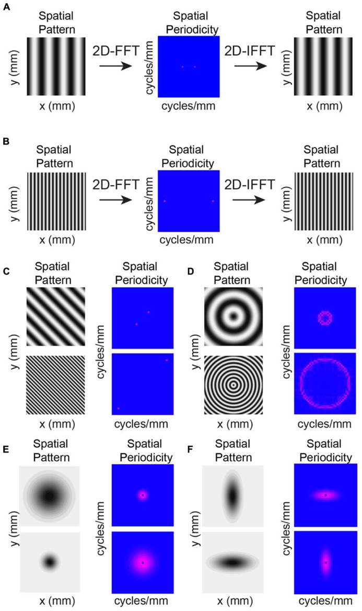

## 数学物理方法 总结

[TOC]

### Chap5. 傅里叶变换

#### Fourier级数

对于一个周期函数
$$
f(x+2l) = f(x),
$$
可以看成是一个无穷维线性空间中的矢量，这个线性空间由基底（函数族）
$$
1, \cos \frac{\pi x}{l}, \cos \frac{2\pi x}{l}, \cdots, \cos \frac{n\pi x}{l},  \cdots \\
\sin \frac{\pi x}{l}, \sin \frac{2\pi x}{l}, \cdots, \sin \frac{n\pi x}{l},  \cdots
$$
张成. 易验证这组基底是正交的. 在 $ k \neq n $ 的情况下，
$$
\begin{align}
\int_{-l}^{l} \cos \frac{k\pi x}{l} \cdot \sin \frac{n\pi x}{l} \, \mathrm{d}x 
&= \int_{-l}^{l} \frac{1}{2} \left[ \sin \frac{(n+k)\pi x}{l}  + \sin \frac{(n-k)\pi x}{l} \right] \, \mathrm{d}x \\
&= \frac{1}{2} \left. \left[ \frac{l}{(n+k)\pi} \cos \frac{(n+k)\pi x}{l}  + \frac{l}{(n-k)\pi}  \cos \frac{(n-k)\pi x}{l} \right]  \right|_{x=-l}^{l} \\
&= 0.
\end{align}
$$
其余同理.

将 $f(x)$ 用该基底表示出来：
$$
f(x) = a_0 + \sum_{k=1}^{\infty} \left( a_k \cos \frac{k\pi x}{l} + b_k \sin \frac{k\pi x}{l}  \right).
$$
这称为函数 $f(x)$ 的**傅里叶级数展开式**，$a_k, b_k$ 称为**傅里叶系数**.

求傅里叶系数的过程可以类比求矢量某一坐标分量的方式. 需要注意的是：

1. 在该线性空间中，内积的定义是
$$
\langle f,g \rangle =\int_{-l}^{l} f(x) \cdot g(x) \, \mathrm{d}x.
$$

2. 上面的三角函数族，只是正交的，并不是单位的.

因此，
$$
\begin{align}
a_k &= \frac{\langle f(x),  \cos \frac{k\pi x}{l} \rangle}{\langle \cos \frac{k\pi x}{l},  \cos \frac{k\pi x}{l} \rangle} \\
&= \frac{\int_{-l}^{l} f(x) \cdot \cos \frac{k\pi x}{l}  \, \mathrm{d}x }{\int_{-l}^{l} \cos ^2\frac{k\pi x}{l}  \, \mathrm{d}x} 
\end{align}
$$
而
$$
\int_{-l}^{l} \cos ^2 \frac{k\pi x}{l}  \, \mathrm{d}x = \frac{1}{2} \int_{-l}^{l} \left( \cos ^2 \frac{k\pi x}{l} + \sin ^2 \frac{k\pi x}{l} \right)  \, \mathrm{d}x  = l,
$$
此处利用了 $\cos ^2 \frac{k\pi x}{l}$ 与 $ \sin ^2 \frac{k\pi x}{l}$ 在 $[-l ,l]$ （一个周期）上的积分值相等的特性.

因此，
$$
\begin{align}
a_0 &= \frac{1}{2l} \int_{-l}^{l} f(x)  \, \mathrm{d}x \\
a_k &= \frac{1}{l} \int_{-l}^{l} f(x) \cdot \cos \frac{k\pi x}{l}  \, \mathrm{d}x \\
b_k &= \frac{1}{l} \int_{-l}^{l} f(x) \cdot \sin \frac{k\pi x}{l}  \, \mathrm{d}x.
\end{align}
$$

值得注意的是：如果被展开的函数 $f(x)$ 是奇函数，那么很自然地任何提供偶函数成分的基底 $\cos \frac{k\pi x}{l}$ 前的系数 $a_k$ 都会是0. 因此展开式成为
$$
f(x) = \sum_{k=1}^{\infty} b_k \sin \frac{k\pi x}{l}.
$$

同理，对于偶函数，展开式为
$$
f(x) = a_0 + \sum_{k=1}^{\infty} a_k \cos \frac{k\pi x}{l}.
$$

##### 函数的沿拓

如果某一函数只在 $ (0,l) $ 上有定义，则可以通过沿拓的方式定义函数在 $(-l,0)$ 上的值，使其成为偶函数或奇函数或者其他形式. 而沿拓的方式实际上并不影响级数在 $(0,l)$ 的值. 

沿拓的方式常常由边界条件决定. 
- 如果要求 $f(0) = f(l) = 0$ ，则应该沿拓为奇函数. 
- 如果要求 $f'(0) = f'(l) = 0$ ，则应该沿拓为偶函数.

##### Fourier级数的完备性

###### Bessel不等式

对于正交归一函数族 $\phi_k$ ，设某一函数 $f(x)$ 可以展开为
$$
f(x) = \sum_{i=1}^{\infty} b_k \phi_k,
$$
研究这样逼近的方差：
$$
\begin{align}
d^2 &= \left\|  f(x) -\sum_{i=1}^{\infty} b_k \phi_k \right\|  ^2\\
&= \| f(x) \| ^2 - 2 \left \langle f(x),  \sum_{i=1}^{\infty} b_k \phi_k \right \rangle + \sum_{i=1}^{\infty}  \| b_k \|^2 \\
&=  \| f(x) \| ^2 - 2 \sum_{i=1}^{\infty}  b_k\langle f(x),   \phi_k \rangle + \sum_{i=1}^{\infty}  \| b_k \|^2 + \sum_{i=1}^{\infty} \langle f(x),   \phi_k \rangle^2 - \sum_{i=1}^{\infty} \langle f(x),   \phi_k \rangle^2 \\
&= \| f(x) \| ^2 + \sum_{i=1}^{\infty}\left(\langle f(x),   \phi_k \rangle - b_k \right)^2 - \sum_{i=1}^{\infty} \langle f(x),   \phi_k \rangle^2.
\end{align}
$$
由此可知，方差最小的逼近必须满足 $\langle f(x),   \phi_k \rangle = b_k$ ，且始终有
$$
\| f(x) \| ^2 \geq \sum_{i=1}^{\infty} \langle f(x),   \phi_k \rangle^2.
$$

###### Parseval定理

**平方可积函数**的傅里叶级数满足
$$
\| f(x) \| ^2 = \sum_{i=1}^{\infty} \langle f(x),   \phi_k \rangle^2 = \sum_{k=0}^{\infty} a_k^2 \|  \cos \frac{k\pi x}{l} \|^2 + \sum_{k=1}^{\infty} b_k^2 \|  \sin \frac{k\pi x}{l} \|^2.
$$

##### Fourier级数的收敛性

上面仅仅探讨了傅里叶级数的方差，对于平方可积函数而言是0. 对于级数局部的收敛性，将由下面的Dirichlet定理给出：

**Dirichlet定理** 若周期函数 $f(x)$ 满足

1. 处处连续，或者在每个周期中只有**有限个第一类间断点**（没有无穷大）；
2. 在每个周期只有有限个极值点，

则傅里叶级数收敛，且级数和
$$
= 
\begin{cases}
f(x), \qquad\text{f  continuous} \\
\frac{1}{2}[f(x+0) + f(x-0)], \quad \text{f discontinuous}
\end{cases}
$$

##### 几个例子

###### Eg 1. 方波的傅里叶展开

对于方波
$$
f(x) = 
\begin{cases}
1, \qquad 0<x<\pi \\
-1, \qquad -\pi<x<0
\end{cases}
$$

因为方波是奇函数，所以展开系数 $a_k = 0$ . 只考虑 $b_k$ :
$$
\begin{align}
b_k &= \frac{1}{\pi} \int_{-\pi}^{\pi} f(x) \sin kx \, \mathrm{d}x \\
&= \frac{2}{\pi} \int_{-\pi}^{\pi} \sin kx \, \mathrm{d}x \\
&= 
\begin{cases}
\frac{4}{k \pi}, \qquad k = 2n+1 \\
0, \qquad k = 2n, n \in \mathbb{Z}
\end{cases}
\end{align}
$$
因此，
$$
f(x) = \frac{4}{\pi} \sum_{k=0}^{\infty} \frac{1}{2k + 1} \sin (2k+1)x.
$$

###### Eg 2. 展开式的边界与原函数不同的例子

对于函数 
$$
f(x) = x + x^2, \qquad x \in (-\pi,\pi),
$$

可以分成两部分处理
$$
h(x) = x, \quad g(x) = x^2
$$

$h(x)$ 是奇函数，因此可以展开为正弦级数.  同理， $g(x)$ 可以展开为余弦级数.
$$
h(x) = \sum_{i=1}^{\infty} b_k \sin kx = \sum_{i=1}^{\infty} (-1)^{n+1} \frac{2}{k} \sin kx. \\
g(x)  = a_0 + \sum_{i=1}^{\infty} a_k \cos kx = \frac{{\pi}^2}{3} + \sum_{i=1}^{\infty} (-1)^n \frac{4}{k^2} \cos kx. \\
f(x) = \frac{{\pi}^2}{3} + \sum_{i=1}^{\infty} \left( (-1)^n \frac{4}{k^2} \cos kx +  (-1)^{n+1} \frac{2}{k} \sin kx \right).
$$
在级数和中置 $ x = \pi$ ，有
$$
f(\pi) = \frac{{\pi}^2}{3} + \frac{4}{1^2} +\frac{4}{2^2} + \frac{4}{3^2} + \cdots
$$
由级数求和公式
$$
\frac{1}{1^2} +\frac{1}{2^2} + \frac{1}{3^2} + \cdots = \frac{\pi^2}{6},
$$
得到
$$
f(\pi) = {\pi}^2.
$$
用原函数验证 
$$
f(\pi) = \pi + \pi^2 \neq \pi^2
$$
这是怎么回事？注意：在将函数 $f(x) = x + x^2, x \in (-\pi,\pi)$ 沿拓到整个平面上的时候，$x = \pi$ 处**是间断点**！此处函数值由Dirichlet定理应当是 
$$
f(\pi) = 1/2[(\pi + \pi^2) + (-\pi + \pi^2)] = \pi^2.
$$

这才与之前的计算相同.

#### 实数形式的Fourier积分与Fourier变换

如果想对实数域上并非周期函数的函数也进行Fourier展开，不妨认为实际上是周期趋于无穷大的情形，即 $l \to \infty$.则展开式为：
$$
\begin{align}
g(x) &= \lim_{l \to +\infty} a_0 + \sum_{k=1}^{\infty} \left( a_k \cos \frac{k \pi x}{l} + b_k \sin \frac{k \pi x}{l} \right). \\
&=\lim_{l \to +\infty}  a_0 + \sum_{k=1}^{\infty} \left[ 
\left(\frac{1}{l} \int_{-l}^{l} g(x) \cdot \cos \frac{k\pi x}{l} \mathrm{d}x \right) \cos \frac{k \pi x}{l} 
+ \left(\frac{1}{l} \int_{-l}^{l} g(x) \cdot \sin \frac{k\pi x}{l} \mathrm{d}x \right) \sin \frac{k \pi x}{l} 
\right]
\end{align}
$$
由于
$$
\lim_{l \to +\infty} a_0 =\lim_{l \to +\infty} \frac{1}{2l} \int_{-l}^{l} f(x)  \mathrm{d}x
$$
如果这个积分收敛，那么必然有 $a_0 = 0$. 另外上式可以采用积分化极限的方法处理，其中积分步长为 $\pi/l$.
$$
\begin{align}
g(x) &=\frac{1}{\pi}\lim_{l \to +\infty}  \sum_{k=1}^{\infty} \left[ 
\left( \int_{-l}^{l} g(x) \cdot \cos \frac{k\pi x}{l} \mathrm{d}x \right) \frac{\pi}{l}\cos \frac{k \pi x}{l} 
+ \left(\int_{-l}^{l} g(x) \cdot \sin \frac{k\pi x}{l} \mathrm{d}x \right) \frac{\pi}{l}\sin \frac{k \pi x}{l} 
\right] \\
&=\frac{1}{\pi} \int_{0}^{\infty} 
\left( \int_{-\infty}^{\infty} g(x) \cdot \cos \omega x \, \mathrm{d}x \right) \cos \omega x \,  \mathrm{d} \omega
+\frac{1}{\pi} \int_{0}^{\infty} \left(\int_{-\infty}^{\infty} g(x) \cdot \sin \omega x  \, \mathrm{d}x \right)  \sin \omega x \, \mathrm{d} \omega \\
&= \int_{0}^{\infty} 
A(\omega) \cos \omega x \,  \mathrm{d} \omega
+\int_{0}^{\infty} B(\omega)  \sin \omega x \, \mathrm{d} \omega
\end{align}
$$
这便是所谓的**傅里叶积分**其中，
$$
A(\omega) = \frac{1}{\pi} \int_{-\infty}^{\infty} g(x) \cdot \cos \omega x \, \mathrm{d}x \\
B(\omega) = \frac{1}{\pi} \int_{-\infty}^{\infty} g(x) \cdot \sin \omega x \, \mathrm{d}x.
$$

被称作是**傅里叶变换**.

傅里叶积分成立需要满足一定条件. 下面给出一种充分条件：

**Fourier积分定理** 若函数 $f(x)$ 在区间 $(-\infty, \infty) $ 上满足

1. $f(x)$ 在任一有限区间上满足Dirichlet条件，
1. $f(x)$ 在区间 $(-\infty, \infty) $ **绝对可积**，即 $ \int_{-\infty}^{\infty} |f(x)| \mathrm{d}x $ 收敛，

则 $f(x)$ 可以表示为傅里叶积分，且傅里叶积分值为
$$
\frac{1}{2}[f(x+0) + f(x-0)].
$$

##### 几个例子

###### Eg 1. 方波脉冲的Fourier变换
对于一个方波脉冲
$$
f(t) = h \, \mathrm{rect}(t/2T) = 
\begin{cases}
h, \qquad |t| < T \\
0, \qquad |t| > T
\end{cases}
,
$$

由于 $f(t)$ 是偶函数，因此
$$
f(t) = \int_{0}^{\infty} A(\omega) \cos \omega t \,  \mathrm{d} \omega, \\
A(\omega) = \frac{2}{\pi} \int_{0}^{T} h \cdot \cos \omega t \, \mathrm{d}t  = \frac{2h}{\pi} \frac{\sin T\omega}{\omega} . \\
$$

###### Eg 2. 有限个正弦波组成的正弦波列
$$
f(t) = 
\begin{cases}
A \sin \omega_0 t, \qquad |t| < \frac{2N\pi}{\omega_0}\\
0, \qquad |t| > \frac{2N\pi}{\omega_0}
\end{cases}
$$

是奇函数. 因此
$$
\begin{align}
f(t) &= \int_{0}^{\infty} B(\omega) \sin \omega t \,  \mathrm{d} \omega, \\
B(\omega) &= \frac{1}{\pi} \int_{-\frac{2N\pi}{\omega_0}}^{\frac{2N\pi}{\omega_0}}A \sin \omega_0 t \cdot \sin \omega t \, \mathrm{d}t  \\
&= \frac{A}{2\pi} \left. \left[ -\frac{1}{\omega + \omega_0} \sin (\omega + \omega_0)t  -\frac{1}{\omega_0 - \omega} \sin (\omega_0 - \omega)t \right]  \right|_{t = -\frac{2N\pi}{\omega_0}}^{\frac{2N\pi}{\omega_0}} \\
&= \frac{A}{\pi} \sin(2N\pi\frac{\omega}{\omega_0}) \left(  \frac{1}{\omega - \omega_0} - \frac{1}{\omega + \omega_0}\right) \\
\end{align}
$$
这个傅里叶变换十分有趣. 可以看出来，在 $\omega \to \pm \omega_0$ 时，$B(\omega)$ 趋于有限值 
$$
\begin{align}
\lim_{\omega \to \pm \omega_0} B(\omega) &= \lim_{\omega \to \pm \omega_0} \frac{A}{\pi} \sin(2N\pi\frac{\omega}{\omega_0}) \left(  \frac{1}{\omega - \omega_0} - \frac{1}{\omega + \omega_0}\right) \\
&= \pm\lim_{\omega \to \pm \omega_0} \frac{A}{\pi} \sin(2N\pi\frac{\omega}{\omega_0}) \frac{1}{\omega \mp \omega_0}  \\
&=\pm \lim_{\omega \to \pm \omega_0} \frac{A}{\pi}  \frac{2N\pi}{\omega_0}\cos(2N\pi\frac{\omega }{\omega_0})  \\
&= \pm\frac{2NA}{\omega_0}
\end{align}
$$

很显然，如果N趋于无穷大，函数逐渐从有限个正弦波变成一个无限长的频率单一的正弦波. $B(\omega) \to \infty$. 而其他 $\omega \neq \pm \omega_0$ 的地方也会被抹平成0. 对于一个单纯的正弦波来说，因为其不满足绝对可积条件，所以不能傅里叶变换. 而此处似乎推广了傅里叶变换的使用范围. 这种推广即是 **广义傅里叶变换** ，之后还会有更多说明.

#### 复数形式的Fourier积分与Fourier变换

将前面的傅里叶积分中的正弦与余弦函数用欧拉公式表示出来

$$
\cos \omega x = \frac{1}{2} (e^{i\omega x} + e^{-i\omega x}) \\
\sin \omega x = \frac{1}{2i} (e^{i\omega x} - e^{-i\omega x}), \\

\begin{align}
f(x) &= \int_{0}^{\infty} 
A(\omega) \cos \omega x \,  \mathrm{d} \omega
+\int_{0}^{\infty} B(\omega)  \sin \omega x \, \mathrm{d} \omega \\
&= \frac{1}{2} \int_{0}^{\infty} \left\{
A(\omega) (e^{i\omega x} + e^{-i\omega x}) - i B(\omega) (e^{i\omega x} - e^{-i\omega x})  \right\}  \, \mathrm{d} \omega \\
&= \frac{1}{2} \int_{0}^{\infty} \left\{
e^{i \omega x} \left( A(\omega) - i B(\omega) \right) + 
e^{-i \omega x} \left( A(\omega) + i B(\omega) \right)
\right\}  \, \mathrm{d} \omega \\
\end{align}
$$

又注意到
$$
\begin{align}
A(\omega) - i B(\omega) 
&=   \frac{1}{\pi} \int_{-\infty}^{\infty} f(x) \cdot \left( \cos \omega x - i\sin \omega x  \right) \, \mathrm{d}x \\
&=  \frac{1}{\pi} \int_{-\infty}^{\infty} f(x) \cdot e^{-i\omega x} \, \mathrm{d}x \\
A(\omega) + i B(\omega) 
&= \frac{1}{\pi} \int_{-\infty}^{\infty} f(x) \cdot e^{i\omega x} \, \mathrm{d}x \\
\end{align}
$$
从而
$$
\begin{align}
f(x) &= \frac{1}{2\pi} \int_{0}^{\infty} \left\{
e^{i \omega x} \left( \int_{-\infty}^{\infty} f(x) \cdot e^{-i\omega x} \, \mathrm{d}x \right) + 
e^{-i \omega x} \left( \int_{-\infty}^{\infty} f(x) \cdot e^{i\omega x} \, \mathrm{d}x \right)
\right\}  \, \mathrm{d} \omega \\
&= \frac{1}{2\pi} \int_{-\infty}^{\infty} \left\{
e^{i \omega x} \left( \int_{-\infty}^{\infty} f(x) \cdot e^{-i\omega x} \, \mathrm{d}x \right)
\right\}  \, \mathrm{d} \omega \\
\end{align}
$$

我们已经将原来实函数三角形式的傅里叶积分写成了负指数形式. 现在，记
$$
\mathcal{F}[f(x)] =  F(\omega) = \frac{1}{2\pi} \int_{-\infty}^{\infty} f(x) \cdot e^{-i\omega x} \, \mathrm{d}x
$$

傅里叶积分就可以表示为
$$
\begin{align}
f(x) &= 
\int_{-\infty}^{\infty}
F(\omega) e^{i \omega x} 
 \, \mathrm{d} \omega .
\end{align}
$$

这是课本上的写法. 一般实际情况中常用对称性形式的傅里叶积分和傅里叶变换，其实就是分配了一下前面的系数：
$$
f(x) = 
\frac{1}{\sqrt{2\pi}} \int_{-\infty}^{\infty} F(\omega) e^{i \omega x}  \, \mathrm{d} \omega \\

F(\omega) = 
\frac{1}{\sqrt{2\pi}} \int_{-\infty}^{\infty} f(x) e^{-i\omega x} \, \mathrm{d}x.
$$

##### 傅里叶变换的基本性质

###### 1. 导数定理

$$
\mathcal{F}[f'(x)] = i \omega \, \mathcal{F}[f(x)].
$$

易由分部积分法证得.

###### 2. 积分定理

$$
\mathcal{F} \left[\int_{x_0}^{x} f(x) \, \mathrm{d}x \right] 
= \frac{1}{i \omega} \, \mathcal{F}[f(x)].
$$

根据导数定理，意识到 $f(x) = \left[\int_{x_0}^{x} f(x) \, \mathrm{d}x \right] '$ 即可.

###### 3. 相似性定理

明确起见，
$$
F(\omega) = \frac{1}{2\pi} \int_{-\infty}^{\infty} f(x) \cdot e^{-i\omega x} \, \mathrm{d}x, \\
\implies 
F(\frac{\omega}{a}) = \frac{1}{2\pi} \int_{-\infty}^{\infty} f(x) \cdot e^{-i \frac{\omega}{a} x} \, \mathrm{d}x
$$

则
$$
\mathcal{F} \left[ f(ax) \right] = \frac{1}{a} F(\frac{\omega}{a}).
$$

简单的变数代换即可得到. 最大的障碍在于正确理解上述记号的意思.

###### 4. 延迟定理

$$
\mathcal{F} \left[ f(x - x_0) \right] = e^{-i \omega x_0} \mathcal{F} \left[ f(x) \right].
$$

###### 5. 位移定理

$$
\mathcal{F} \left[ e^{i \omega x_0} f(x) \right] = F(\omega - \omega_0)
$$

###### 6. 卷积定理

$$
\mathcal{F} \left[ f_1(x) * f_2(x) \right] = 2\pi \mathcal{F} \left[ f_1(x) \right] \mathcal{F} \left[ f_2(x) \right].
$$

上式中，卷积 $f_1(x) * f_2(x)$ 的定义是：
$$
f_1(x) * f_2(x) = \int_{-\infty}^{\infty} f_1(\xi) f_2(x - \xi) \mathrm{d} \xi.
$$

证明如下：
$$
\begin{align}
\mathcal{F} \left[ f_1(x) * f_2(x) \right] 
&= \frac{1}{2\pi} \int_{-\infty}^{\infty} \int_{-\infty}^{\infty} e^{-i \omega x} f_1(\xi) f_2(x - \xi) \mathrm{d} \xi \mathrm{d} x \\
&= \frac{1}{2\pi} \int_{-\infty}^{\infty} \int_{-\infty}^{\infty} f_1(\xi) e^{-i \omega \xi} f_2(x - \xi) e^{-i \omega (x - \xi)}  \mathrm{d} \xi \mathrm{d} x \\
&= \frac{1}{2\pi} \int_{-\infty}^{\infty} f_1(\xi) e^{-i \omega \xi} \left( \int_{-\infty}^{\infty}  f_2(x - \xi) e^{-i \omega (x - \xi)} \mathrm{d} x \right) \mathrm{d} \xi \\
\end{align}
$$

式中对 $x$ 的积分，其中 $\xi$ 只是一个参数. 因此做变数代换 $t = x - \xi$ ：
$$
\begin{align}
&= \frac{1}{2\pi} \int_{-\infty}^{\infty} f_1(\xi) e^{-i \omega \xi} \left( \int_{-\infty}^{\infty}  f_2(t) e^{-i \omega t}  \mathrm{d} t \right) \mathrm{d} \xi \\
&= \frac{1}{2\pi} \int_{-\infty}^{\infty} f_1(\xi) e^{-i \omega \xi} \mathrm{d} \xi \cdot \int_{-\infty}^{\infty}  f_2(t) e^{-i \omega t}  \mathrm{d} t  \\
&= 2\pi \mathcal{F} \left[ f_1(x) \right] \mathcal{F} \left[ f_2(x) \right].
\end{align}
$$

##### 高维空间的Fourier积分

以二维情况为例：
$$
f(x, y) = 
\frac{1}{2\pi} \iint_{-\infty}^{\infty} F(k_1, k_2) e^{i (k_1 x + k_2 y)}  \, \mathrm{d} k_1 \mathrm{d} k_2 \\

F(k_1, k_2) = 
\frac{1}{2\pi} \iint_{-\infty}^{\infty} f(x, y) e^{-i (k_1 x + k_2 y)} \, \mathrm{d} x \mathrm{d} y.
$$

对于得到的 $F(k_1, k_2)$ 的意义，可以这么理解：做变数代换 $u = (k_1 x + k_2 y) / \sqrt{k_1^2+k_2^2}$ 代换掉 y，记 $\alpha$ 为矢量 $\mathbf{k} = (k_1, k_2)$ 与x轴的夹角， $\omega$ 为 $\mathbf{k}$ 的模长 ，则有
$$
\sin \alpha = \frac{k_2}{\omega}, \qquad \tan \alpha = \frac{k_1}{k_2} \\
y = \frac{u}{\sin \alpha} - \frac{x}{\tan \alpha}.
$$

$$
\begin{align}
F(k_1, k_2) &= 
\frac{1}{2\pi} \iint_{-\infty}^{\infty} f \left(x, \frac{u}{\sin \alpha} - \frac{x}{\tan \alpha} \right) e^{-i \omega u} \, \left| \frac{\partial (x, y)}{ \partial (x, u)} \right| \mathrm{d} x \mathrm{d} u \\
&=
\frac{1}{2\pi} \int_{-\infty}^{\infty} e^{-i \omega u} \left(  \int_{-\infty}^{\infty} \frac{1}{\sin \alpha} f \left(x, \frac{u}{\sin \alpha} - \frac{x}{\tan \alpha} \right) \, \mathrm{d} x \right) \mathrm{d} u
\end{align}
$$

其中对x的积分，其实就是 $f(x, y)$ 在垂直于 $(k_1, k_2)$ 的直线族上的积分.  按照我们的构造，这个积分是不依赖于 $\mathbf{k}$ 的模长的. 记这个积分为
$$
g_\alpha(u) = \int_{-\infty}^{\infty} \frac{1}{\sin \alpha} f \left(x, \frac{u}{\sin \alpha} - \frac{x}{\tan \alpha} \right) \, \mathrm{d} x,
$$

则
$$
F(k_1, k_2) = F_\alpha(\omega) = \int_{-\infty}^{\infty} e^{-i \omega u} g_\alpha(u) \, \mathrm{d} u.
$$

**所以实际上，k平面上的某个点的值的意义就是，原点到该点连线的 $\alpha$ 角对应的函数 $g_\alpha(u)$ 的傅里叶展开，$F_\alpha(\omega)$ ，在 $\omega$ 为该点到原点距离时的值 .**

##### $\delta$ 函数

定义广义函数 $\delta (x)$ 满足
$$
\int_{-\infty}^{\infty} f(x)\delta(x - x_0) \mathrm{d}x = f(x_0).
$$

于是我们得到
$$
\int_{-\infty}^{\infty} \delta(x) \mathrm{d}x = 1. \\
\delta (x) = 
\begin{cases}
0, \qquad x \neq 0 \\
+\infty, \qquad x = 0.
\end{cases}
$$
所以， $\delta(x)$ 是偶函数，而偶函数的导数是奇函数，因此 $\delta '(x)$ 是奇函数.

同时，可以定义 **阶跃函数** （Heaviside函数）
$$
H(x) = \int_{-\infty}^{x} \delta(t) \mathrm{d}t = 
\begin{cases}
0, \qquad x < 0 \\
1, \qquad x > 0.
\end{cases}
$$

$\delta$ 函数有这样一个性质：
如果 $\phi(x) = 0$ 的实根 $x_k$ 全是单根，则有
$$
\delta[\phi(x)] = \sum_k \frac{\delta (x - x_k)}{|\phi'(x_k)|}.
$$

可以这样去证明：
$$
\int_{x_k - \epsilon}^{x_k + \epsilon} \delta[\phi(x)] \mathrm{d} x = \int_{x_k - \epsilon}^{x_k + \epsilon} c_k \delta (x - x_k) \mathrm{d} x.\\
1 = \int_{-\epsilon}^{\epsilon} \delta(\phi) \mathrm{d} \phi = \int_{x_k - \epsilon'}^{x_k +\epsilon'} \delta[\phi(x)] |\phi'(x)| \mathrm{d} x.
$$

则显然 $c_k = \frac{1}{|\phi'(x_k)|}$. 

绝对值是因为在第二行式子中，如果导数小于0，积分上下限在换元后会上小下大. 调整回上大下小的形式消耗掉了导数的负号.

###### 函数序列视角下的 $\delta$ 函数
容易证得，
$$
\delta (x) = \lim_{l \to 0} \frac{1}{l} \mathrm{rect} (x/l) \\
\delta (x) = \lim_{K \to \infty} \frac{1}{\pi} \frac{\sin Kx}{x} \\
\delta (x) = \lim_{\epsilon \to 0} \frac{1}{\pi} \frac{\epsilon}{\epsilon^2 + x^2}. \\
$$

###### $\delta$ 函数的傅里叶变换
先不管三七二十一，直接形式上对  $\delta$ 函数进行傅里叶变换
$$
F(\omega) = \frac{1}{2\pi} \int_{-\infty}^{\infty}  \delta (x) e^{-i \omega x} \mathrm{d} x  = \frac{1}{2\pi}, \\
\delta (x) = \frac{1}{2\pi} \int_{-\infty}^{\infty} e^{i \omega x} \mathrm{d} \omega.
$$

这是很神奇的结论. 因为在通常意义下，积分 $\int_{-\infty}^{\infty} e^{i \omega x} \mathrm{d} \omega$ 根本是不存在的. 所以这里的傅里叶变换已经推广为广义傅里叶变换.

**Eg. $f(t) =\sin \omega_0 t$ 的Fourier变换.**

前文已经提到过，这个函数在一般意义下不满足Dirichlet条件，因此不能被傅里叶变换.
在广义傅里叶变换的背景下：

$$
\begin{align}
F(\omega) &= \frac{1}{2\pi} \int_{-\infty}^{\infty}\sin \omega_0 t e^{-i \omega x} \mathrm{d} x \\
&= \frac{1}{4\pi i} \int_{-\infty}^{\infty} [e^{i (\omega_0 - \omega) x} - e^{-i (\omega_0 + \omega) x} ] \mathrm{d} x \\
&= \frac{1}{2i}[\delta (\omega_0 - \omega) - \delta (\omega_0 + \omega)]
\end{align}
$$

**Eg. 方程 $\Delta G(\mathbf{r}) = \delta(\mathbf{r})$ **

需要注意的是，此处的 $\delta$ 函数是三维的版本. $\delta(\mathbf{r}) = \delta(x)\delta(y)\delta(z)$.

不妨把函数G和 $\Delta G(\mathbf{r})$ 表示为傅里叶积分的形式：
$$
G(\mathbf{r}) = \frac{1}{(2\pi)^{3/2}} \iiint_{\mathbb{R}} F(\mathbf{k}) e^{i \mathbf{k} \cdot \mathbf{r}} \mathrm{d} \tau. \\
\implies 
\Delta G(\mathbf{r}) = \frac{1}{(2\pi)^{3/2}} \iiint_{\mathbb{R}} -\mathbf{k}^2 F(\mathbf{k}) e^{-i \mathbf{k} \cdot \mathbf{r}} \mathrm{d} \tau. \\
$$

代回原式：
$$
\delta(\mathbf{r}) = \frac{1}{(2\pi)^{3/2}} \iiint_{\mathbb{R}} -\mathbf{k}^2 F(\mathbf{k}) e^{i \mathbf{k} \cdot \mathbf{r}} \mathrm{d} \tau. \\
$$

而又因为
$$
\delta(\mathbf{r}) = \frac{1}{(2\pi)^{3/2}} \iiint_{\mathbb{R}} C(\mathbf{k}) e^{i \mathbf{k} \cdot \mathbf{r}} \mathrm{d} \tau. \\
C(\mathbf{k}) = \frac{1}{(2\pi)^{3/2}} \iiint_{\mathbb{R}} \delta(x)\delta(y)\delta(z) e^{-i \mathbf{k} \cdot \mathbf{r}} \mathrm{d} x \mathrm{d} y \mathrm{d} z = \frac{1}{(2\pi)^{3/2}}.\\
\implies
\delta(\mathbf{r}) = \frac{1}{(2\pi)^{3/2}} \iiint_{\mathbb{R}} \frac{1}{(2\pi)^{3/2}} e^{i \mathbf{k} \cdot \mathbf{r}} \mathrm{d} \tau.
$$

则
$$
-\mathbf{k}^2 F(\mathbf{k}) = \frac{1}{(2\pi)^{3/2}} \\
\implies
F(\mathbf{k}) = - \frac{1}{(2\pi)^{3/2}} \frac{1}{\mathbf{k}^2}
$$

至此，我们实际上求出了 $G(\mathbf{r})$ 的傅里叶变换. 下面只需要进行傅里叶积分，将其变回 $G(\mathbf{r})$ 即可.
$$
\begin{align}
G(\mathbf{r}) &= \frac{1}{(2\pi)^{3/2}} \iiint_{\mathbb{R}} - \frac{1}{(2\pi)^{3/2}} \frac{1}{\mathbf{k}^2} e^{i \mathbf{k} \cdot \mathbf{r}} \mathrm{d} \tau \\
&= - \frac{1}{(2\pi)^{3}} 
\int_{0}^{2\pi} \int_{0}^{\pi} \int_{0}^{+\infty}
\frac{1}{\mathbf{k}^2} e^{i \mathbf{k} \cdot \mathbf{r}} \mathbf{k}^2 \sin \theta 
\mathrm{d} k \mathrm{d} \theta \mathrm{d} \phi \\
&= -\frac{1}{(2\pi)^{2}} 
\int_{0}^{+\infty} \int_{0}^{\pi}
e^{i kr \cos \theta} \mathrm{d} \cos \theta
\mathrm{d} k \\
&= -\frac{1}{2 \pi^{2}} 
\int_{0}^{+\infty} \frac{1}{2ikr}
(e^{-i kr} - e^{i kr})
\mathrm{d} k \\
&= -\frac{1}{2 \pi^{2}} 
\int_{0}^{+\infty} \frac{1}{kr}
(\sin kr)
\mathrm{d} k \\
&= -\frac{1}{4 \pi |\mathbf{r}|}. 
\end{align}
$$

